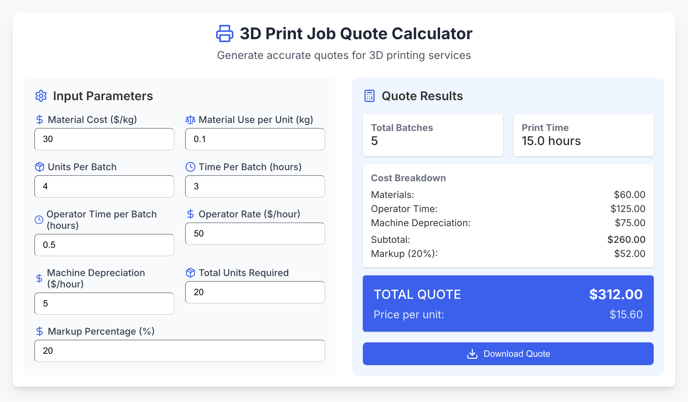

# 🧮 3D Print Job Quote Calculator

A sleek, professional web app for creating detailed quotes for 3D printing jobs. Designed to simplify and standardize your quoting process, this tool calculates pricing based on real-world variables—material usage, machine wear, labor costs, and your preferred markup.



## ✨ Key Features

* **Intuitive Interface** — Clean, real-time UI for seamless quote creation
* **Detailed Cost Breakdown** — Includes:

  * Material costs
  * Operator labor
  * Machine depreciation
* **Automated Calculations** — Instantly computes:

  * Number of batches required
  * Total print time
  * Cost per unit and per batch
* **Quote Export** — Download professional, ready-to-share quote files in plain text format
* **Mobile-Friendly** — Responsive design works across phones, tablets, and desktops

## 🚀 Getting Started

### Requirements

* Node.js v14+
* npm or yarn

### Installation Steps

1. **Clone the repo**

   ```bash
   git clone https://github.com/your-username/3d-print-calculator.git
   cd 3d-print-calculator
   ```

2. **Install dependencies**

   ```bash
   npm install
   ```

3. **Run the development server**

   ```bash
   npm start
   ```

4. Open your browser at [http://localhost:3000](http://localhost:3000)

## 🛠️ How to Use

1. Input your parameters:

   * Material cost per kg
   * Material used per unit (kg)
   * Units per batch
   * Print time per batch (hrs)
   * Operator time per batch (hrs)
   * Operator hourly rate
   * Machine depreciation per hour
   * Total units to be printed
   * Markup percentage

2. View pricing updates in real time

3. Download a professional quote with a single click

## 🔧 Customization

To modify default values, update the `useState` hooks in `PrintQuoteCalculator.jsx`:

```javascript
const [materialCost, setMaterialCost] = useState(30);      // Default cost per kg
const [operatorRate, setOperatorRate] = useState(50);      // Default labor rate
// ...and more
```

## 🌍 Deployment Options

Easily deploy the app to any static hosting provider:

* GitHub Pages
* Vercel
* Netlify
* Coolify (self-hosted)

## 🤝 Contributing

Pull requests are welcome! If you'd like to contribute, please fork the repo and submit a PR.

## 🙌 Acknowledgments

* Built with **React**
* Icon set powered by **Lucide React**
* Styled using lightweight, **vanilla CSS** for broad compatibility

## 📄 License

This project is licensed under the MIT License. See the [LICENSE](LICENSE) file for full details.
